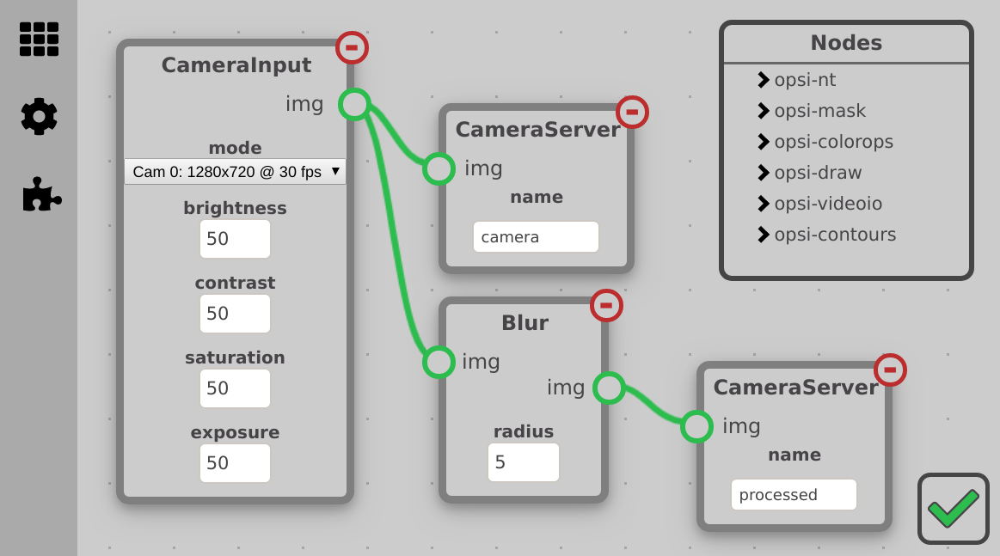

## OpenSight: the powerful, easy-to-use vision suite

OpenSight is an FRC-focused, free and open source computer vision system targeted specifically for the Raspberry Pi. Our goal is to make it easy for people not familiar with vision to be able to make complex pipelines, while also providing powerful functionality for advanced users.

## Want to get it?
For Raspberry Pi, Download the [latest release image](https://github.com/opensight-cv/opsi-gen/releases/latest), flash it onto a micro-sd card, plug it in, then navigate to http://opensight.local once connected to a robot network.

For installing OpenSight on non-Raspberry Pi devices and for upgrading from previous versions of OpenSight, you can find more information [here](https://github.com/opensight-cv/packages#how-do-i-upgrade-an-existing-installation-of-opensight).

## About

Our mission is to create an accessible vision suite, with an easy-to-use and works out-of-the box experience, but also allow for more power and greater customizability. We want to make vision more accessible to those with less experience, while also providing the tools for power users and developers to easily add features beyond the default modules.
