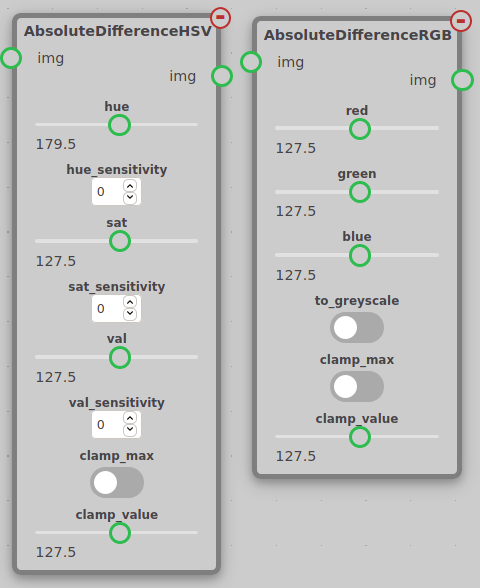
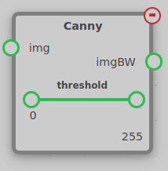
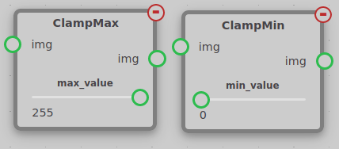
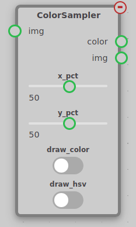
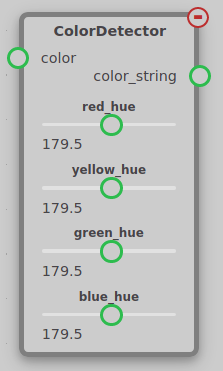

The ColorOps module contains nodes used to manipulate an image directly. These nodes can be found under the opsi-colorops tab.

## Absolute Difference RGB/HSV

The Absolute Difference node takes an input `img` and calculates the difference between each pixel in the image and a reference value.

The RGB node has a `red`, `green`, and `blue` parameter to set the reference color. If a pixel in the input exactly matches the reference, the pixel in the output will be black. The further the pixel is from the reference, the brighter the output pixel will be. The RGB node also has a `to_greyscale` parameter. When `to_greyscale` is off, the output will be in RGB with the each channel being set to the difference from the reference in that channel. This can be used to invert an image by setting `to_greyscale` to false and set `red`, `green`, and `blue` to 255.

The HSV node has a `hue`, `sat`, and `val` parameter to set the reference color in the HSV color system. HSV is a color system that reflects how humans perceive color. More information on the HSV color system can be found in [this article](https://www.lifewire.com/what-is-hsv-in-design-1078068). There are also sensitivity settings that effect how sensitive the output is to differences in hue, saturation, and value individually. For instance, if you only care about the hue of a pixel, you can set `hue_sensitivity` to some positive value and `sat_sensitivity` and `val_sensitivity` to zero.

Both the RGB and HSV nodes have a `clamp_max` setting. If `clamp_max` is selected, any pixels with a value above `clamp_value` will have their value set to `clamp_value`. This can be used to do a form of thresholding where pixels that match the reference color appear dark (But still have some contrast) and everything else is a flat background.

## Blur

The Blur node takes an input `img` and blurs the image to produce the output `img`. The blur process is known as a box blur, where each pixel's red, green, and blue values are individually averaged with the pixels surrounding it. The number of pixels it is averaged with determined by the `radius` setting, which is the radius of the surrounding pixels to be averaged with.

## Canny

The Canny node takes an input `img` and detects edges in the image. The output is a black-and-white image with white pixels representing lines in the input image. The Canny node has a `threshold` value to set its sensitivity. Any edge that is stronger than the upper end of the threshold setting is automatically kept, and any edge between the lower and upper threshold is only kept if it is connected to an edge above the upper edge of the threshold. You can read more about the threshold setting [in this OpenCV tutorial](https://docs.opencv.org/master/da/d22/tutorial_py_canny.html).

## Clamp Min/Max

The clamp min/max nodes limit the minimum and maximum value of pixels in an image.

ClampMin increases the brightness of any pixel below its threshold to its threshold.

ClampMax decreases the brightnss of any pixel above its threshold to its threshold.

## Color Sampler

The Color Sampler node samples the color of a point in an image and outputs the result in RGB. It has two sliders, `x_pct` and `y_pct`, which are used to set the point in the image that is sampled. These values are percentages of the image resolution. There is also an option `draw_color` to draw a point on the image and the RGB values detected, or the HSV values detected by selecting the `draw_hsv` option.

## Color Detector

The Color Detector node is intended to be used with the Color Sampler node to detect which color of the Control Panel from Infinite Recharge is being sampled. The node has a parameter for the hue of each color of the color wheel. You can tune these values by enabling the `draw_color` and `draw_hsv` options on the Color Sampler node to view the HSV values of each section of the color wheel.

## Greyscale

The Greyscale node takes an input `img` and outputs the greyscale version of that image to `img`. This is done by multiplying each pixel's red, green, and blue values by constant value, then summing them, to produce a greyscale image. Each red value is multiplied by 0.299, green by 0.587, blue by 0.114. These constants are based off of how humans perceive color.

!!! note
    The output of this node is not an `imgBW`, but is instead a normal `img` that only contains greyscale values, and thus cannot be used as an input for nodes such as the [FindContours](contours.md#findcontours) node.

## HSVRange

The HSVRange node takes an input `img` and outputs a black and white image to `imgBW`. This image's white pixels are pixels whose color passed the HSV filter described in the node's settings. Each setting contains a slider with two controllable handles, which define the upper and lower acceptable bounds of each value.

HSV is a color system that reflects how humans perceive color. More information on the HSV color system can be found in [this article](https://www.lifewire.com/what-is-hsv-in-design-1078068).
