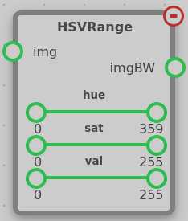

The ColorPps module contains nodes used to manipulate an image directly. These nodes can be found under the opsi-colorops tab.

## Blur

The Blur node takes an input `img` and blurs the image to produce the output `img`. The blur process is known as a box blur, where each pixel's red, green, and blue values are individually averaged with the pixels surrounding it. The number of pixels it is averaged with determined by the `radius` setting, which is the radius of the surrounding pixels to be averaged with.

## Greyscale

The Greyscale node takes an input `img` and outputs the greyscale version of that image to `img`. This is done by multiplying each pixel's red, green, and blue values by constant value, then summing them, to produce a greyscale image. Each red value is multiplied by 0.299, green by 0.587, blue by 0.114. These constants are based off of how humans perceive color.

!!! note
    The output of this node is not an `imgBW`, but is instead a normal `img` that only contains greyscale values, and thus cannot be used as an input for nodes such as the [FindContours](contours.md#findcontours) node.

## HSVRange

The HSVRange node takes an input `img` and outputs a black and white image to `imgBW`. This image's white pixels are pixels whose color passed the HSV filter described in the node's settings. Each setting contains a slider with two controllable handles, which define the upper and lower acceptable bounds of each value.

HSV is a color system that reflects how humans perceive color. More information on the HSV color system can be found in [this article](https://www.lifewire.com/what-is-hsv-in-design-1078068).
