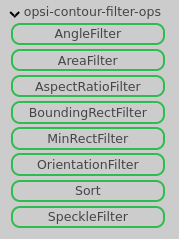
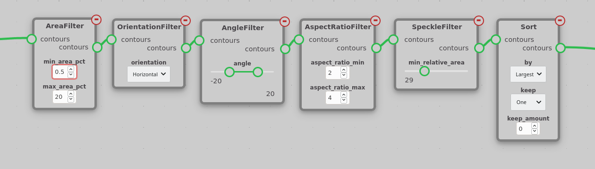
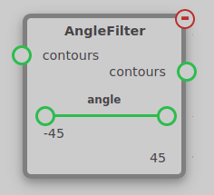
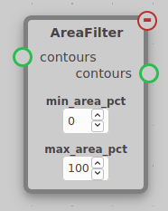
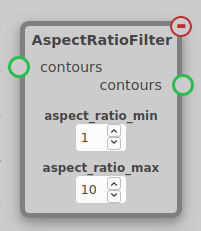
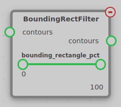
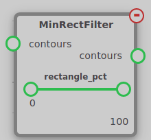
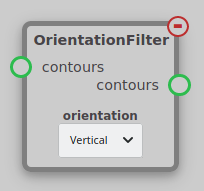
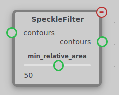
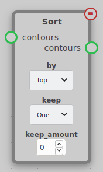

The Contour Filter module contains nodes used to filter out unwanted contours found by FindContours. These nodes can be found under the opsi-contour-filter-ops tab.

Typically, you will want to use a chain of contour filters ending with a Sort node like this:

## AngleFilter

Filters contours based on the area of their minimum area bounding rectangle. Any contour whose minimum area rectangle is not within the range of the `angle` parameter will be filtered out. An angle of zero means that the top/bottom side of the rectangle will be horizontal. Since this node makes no distinction between horizontal and vertical rectangles, it is best to use it in conjuction with the OrientationFilter node.

## AreaFilter

Filters contours based on the percentage of the area of the image they cover. Any contour whose area as a percentage of the image is not between `min_area_pct` and `max_area_pct` will be filtered out. Since this node uses area as a percentage of the image, it should act the same regardless of image resolution.

## AspectRatioFilter

Filters contours based on their aspect ratio. The aspect ratio of a contour is defined as the ratio between the length of the longest and shortest side of its minimum area rectangle. Any contour whose aspect ratio is not between `aspect_ratio_min` and `aspect_ratio_max` will be filtered out.

## BoundingRectFilter & MinRectFilter

Filters contours based on how close to a rectangle their shape is. This is defined by the percentage of their bounding rectangle they cover. Any contour whose area as a percentage of the area of its bounding rectangle is not within the given range will be filtered out. In the case of BoundingRectFilter, the countours' non-rotated bounding rectangle is used, and in the case of MinRectFilter, their rotated minimum area rectangle is used.

## OrientationFilter

Filters contours based on their orientation. Contours that are shorter than they are wide are considered horizontal, and contours that are taller than they are wide are considered vertical. Only contours matching the `orientation` setting will be kept.

## SpeckleFilter

Filters out contours that are much smaller than the largest contour. Any contour whose area is less than `min_relative_area`% of the largest contour's area is filtered out. This is useful when there are multiple targets that are close to the same size.

## Sort

The sort node orders the contours by either their area or their location in the image and optionally keeps the top contour or the top several contours in the sorted list.

The contours are ordered by the criteria selected for the `by` parameter. `Top`, `Bottom`, `Left`, `Right`, and `Center` sort the contours based on their position in the image. `Largest` and `Smallest` sort the contours based on their area.

The `keep` parameter determines how many contours are kept. If `keep` is set to `One`, only the top contour in the sorted list is kept. If `keep` is set to `Number`, the top `keep_amount` of contours are kept. If `keep` is set to `All`, all contours are kept, but they are still sorted. `keep_amount` parameter is only used when `keep` is set to `Number`.

