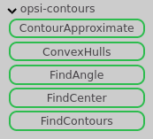
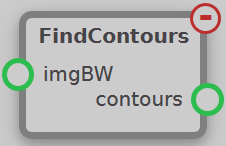
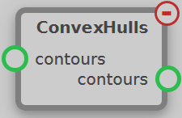
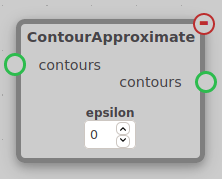
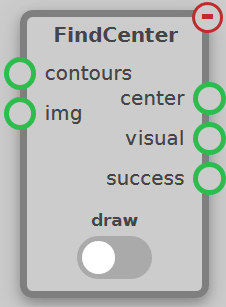
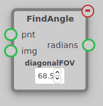

The Contours module contains nodes used to find and manipulate contours in an image. These nodes can be found under the opsi-contours tab.

## FindContours

Find and outputs the `contours` of the input `imgBW`. This utilizes the OpenCV method `findContours` to find all of the contours in the image. A contour is the set of points that encircles each section of the input image that is white (meaning that those areas were passed a threshold of color). This node is the root source of all contours for nodes such as FindCenter of ConvexHulls.

## ConvexHulls

Finds and outputs the convex hull of each contour in the input `contours`. A convex hull is the convex form of a contour, meaning that the outside angles of each vertex is at least 180 degrees. One way to make this easier to understand is to imagine wrapping a string around the contour. This string would be the convex hull, as all its outside angles would be greater than 180 degrees.

## ContourApproximate

This node approximates contours by reducing their number of points. It takes one perameter, `epsilon`, which is the maximum distance between the output contour and the input contour. This node works the same way as the OpenCV function [ApproxPolyDP](https://docs.opencv.org/2.4/modules/imgproc/doc/structural_analysis_and_shape_descriptors.html#approxpolydp).

## FindCenter

Finds and outputs the center of the `contours` supplied. The node starts by finding the center of each individual contour. This is done by finding the bounding box of each contour and finding the center of that bounding box. Next, the overall center is determined by taking the center of each contour and finding the center of those points. The output `center` is this final center that is determined, scaled from -1 to 1 in each axis, where (0,0) is the center of the image. This scaling makes changing cameras or resolution much easier. The output `success` is `True` if at least one contour is present to have its center found, and is otherwise `False`.

The `draw` setting is whether to draw the contours onto the `img` input before outputting them. If the setting is enabled, the bounding boxes, centers, and connecting lines will be drawn on the image before being output to `visual`. If the setting is disabled, then the output `visual` will simply be the input `img`.

## FindAngle

This node converts coordinates (Like those found by FindCenter) to radians based on the resolution of the image and the FOV of the camera.
