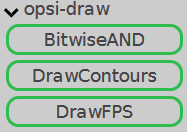
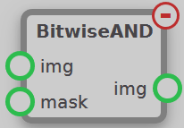
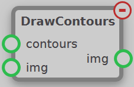
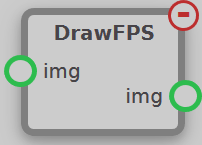

The Draw module contains nodes used to draw on images. These nodes can be found under the opsi-draw tab.

## BitwiseAND

Uses a mask to select and output only the pixels of the input `img` that are white on the `mask` input. These pixels are taken and put to an output `img`, with the rest of the pixels being black.

## DrawContours

Takes an image `img` and draws the input `contours` onto the image.

## DrawFPS

This node draws the number of frames per second of onto the top left of input `img` and outputs the updated image.
