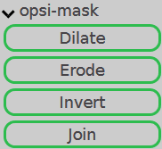
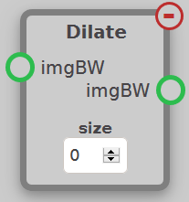
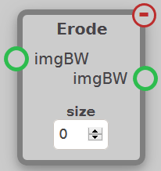
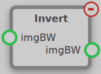
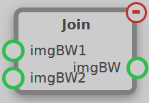

The Mask module contains nodes used to manipulate masks (which take the form of `imgBW`). Masks can be turned into contours using [FindContours](contours.md#findcontours) or filter images using [BitwiseAND](draw.md#bitwiseand). These nodes can be found under the opsi-draw tab.

## Dilate

Takes a mask (`imgBW`) and extends all of its borders by the number of pixels defined in the `size` setting.

## Erode

Takes a mask (`imgBW`) and removes the number of pixels around all its borders as defined in the `size` setting.

## Invert

Inverts the mask such that all white areas become black and vise versa, essentially inverting the mask's effect.

## Join

Joins two masks (`imgBW1` and `imgBW2`) such that if a pixel is white on either mask, it is white on the output mask.
