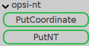
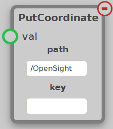
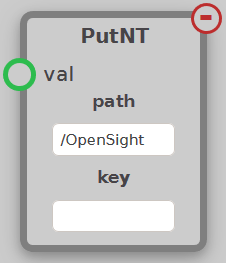

The NetworkTables (NT) module contains nodes used to output data to NetworkTables. NetworkTables is a framework provided by FIRST to easily send data between processors on the robot and to the driver station. These nodes can be found under the opsi-nt tab.

## Accessing NetworkTables Values

To access values from NetworkTables, use the following example code snippets for Java and C++. Replace the values `key` and `table` based off of the options in the node, and `type` based off what type of value you are outputting. E.g. `boolean`, `int`, `double`, etc.

Java
```java
NetworkTableInstance.getDefault().getTable("<table>").getEntry("<key>").get<Type>(<default>);
```

C++
```C++
nt::NetworkTableInstance::GetDefault().GetTable("<table>")->Get<Type>("<key>", <default>);
```



## PutCoordinate



Takes a coordinate value and outputs it to NetworkTables. These values can be found under the table defined in the `path` setting, and under the values `[key]-x` and `[key]-y`. This node will often follow a [FindCenter](contours.md#findcenter) node to output the center found.

## PutNT



The PutNT node puts a value of any type, not just a coordinate, to NetworkTables. This value can be found under the table defined in the `path` setting, and under the value defined in the `key` setting.
