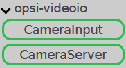
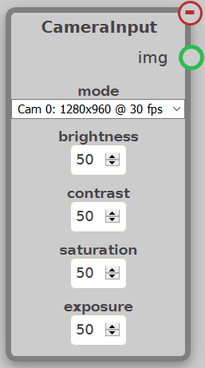
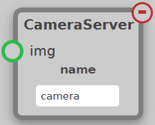

The VideoIO module contains nodes used to get and output video from the coprocessor OpenSight is being run on. These nodes can be found under the opsi-videoio tab.

## CameraInput

Outputs an `img` of what a camera sees. The dropdown setting of the node controls the resolution and speed of the camera. The options `brightness`, `contrast`, `saturation`, and `exposure` control the corresponding settings on the camera video feed. For a quick summary, `brightness` controls how light the image is. `contrast` controls the contrast between light and dark on the output of the image. `saturation` controls how saturated the image is with white colors. `exposure` controls how long the camera absorbs light for each frame.

## CameraServer

The CameraServer node takes an `img` input and outputs it to a stream so that it can be viewed on the driver station. You can see the Camera Stream on the Dashboard/Shuffleboard, or you can go to the hooks menu and click `opsi.videoio` and select the CameraServer.
